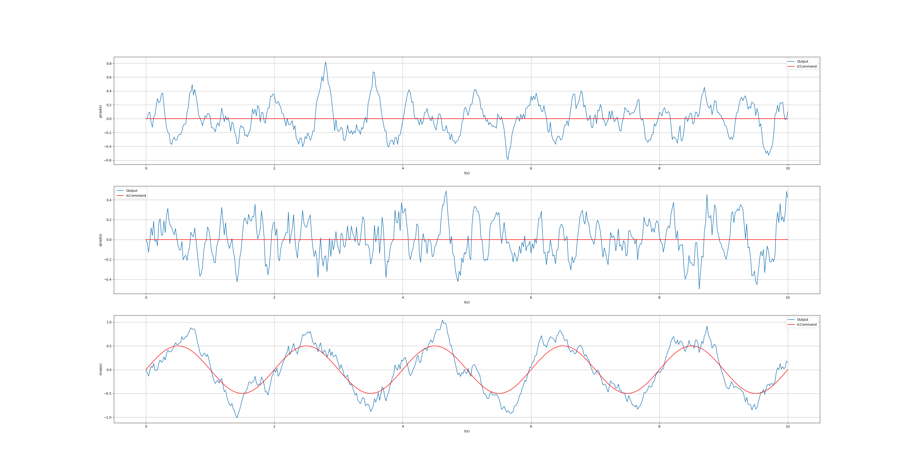
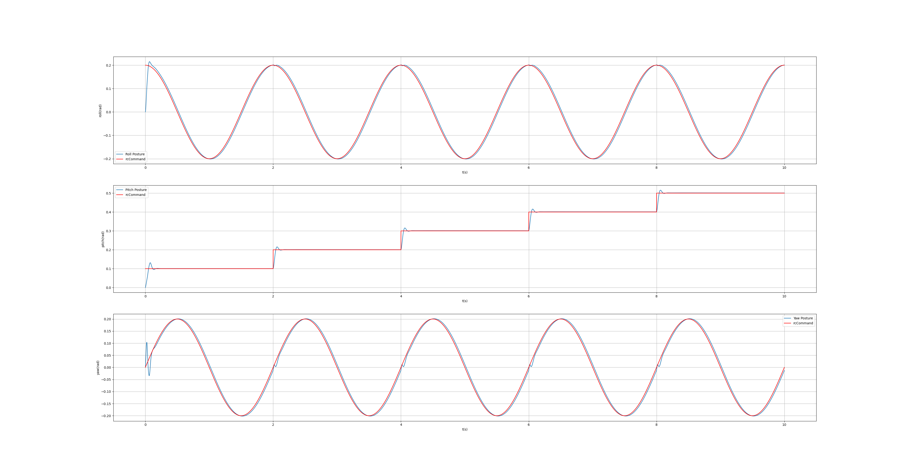

Since March 2025, I have been collaborating with Professor **Huichan Zhao** to develop an innovative flight control system for an ultra-lightweight drone utilizing soft artificial muscles. The drone weighs only 23 grams and employs Dielectric Elastomer Actuators (DEA) as its primary propulsion mechanism.

## Project Overview
This research focuses on overcoming the unique challenges of controlling drones powered by soft artificial muscles. Unlike traditional motor-based systems, DEA actuators offer silent operation, high energy efficiency, and biomimetic movement patterns, but require specialized control approaches due to their nonlinear electromechanical properties.

### Flight Controller Development
I am designing a custom flight controller architecture specifically optimized for DEA-driven drones:
- Implemented real-time control algorithms accounting for DEA hysteresis and viscoelastic behavior
- Developed adaptive PID controllers with gain scheduling for voltage-to-strain conversion
- Integrated sensor fusion for IMU data processing with Kalman filtering

### Simulator Implementation
To enable safe testing and rapid prototyping, I built a physics-based simulator featuring:
- High-fidelity DEA actuator models with electromechanical coupling dynamics
- Aerodynamic modeling for ultra-lightweight frames
- Real-time visualization of drone state and actuator deformation

## Technical Challenges
The project addresses several key research challenges:
1. **Nonlinear Control**: Compensating for DEA's voltage-dependent strain response and creep effects
2. **Weight Constraints**: Implementing full control stack within 23g total system mass

## Current Progress
As of today, we have achieved:
- Successful closed-loop attitude control in simulation with <5° steady-state error
- Preliminary flight tests in mujoco simulation, demonstrating basic stabilization capabilities

  
  

[Project repository link to be added upon publication]