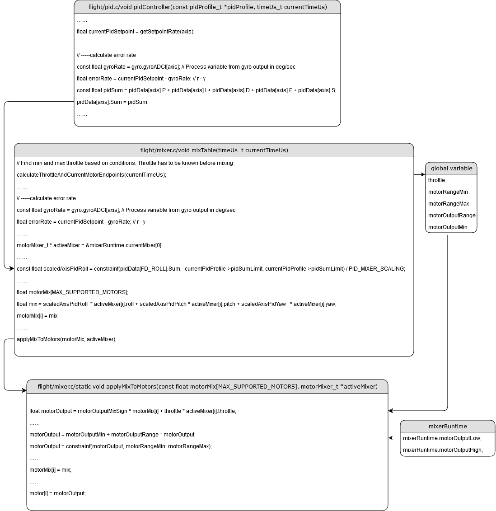

From September till December, 2024, I joint a team in UTIAS, University of Toronto, which mainly focus on Autonomous Drone Racing.

Under professor Hugh H. T. Liu's guidance, I mainly focus on building a simulator for the drone, also planned the yaw angle.

## Research Overview
Human pilots can use their own talent to controll drones to fly rapidly through gates, and the goal of the whole team is to use computer-based autonomous pilot to guide the drone.

## My Contribution
### Building a simulation system
The team previously used Betaflight to be its flight controller. However, to make full use of AI, we need to simulate how the drone behaves. So, developing a simulator according to Betaflight's original code is very important.

I read all the lines from Betaflight, and extracted the controller code and test it. Also, I tested the input signal and output RPM curve.

This task is not a hard one, but it took me a lot of time to get to know how Betaflight work. As an open-source code, it's super long and hard to read.

The following is the code structure of Betaflight that I organized：

This one is a demo of the part I contributed for the simulator:

### Yaw planning
The racing drone we built is using computer vision to guide and locate itself. The drone need to look at the "gate" to get to know where it is.

My work is to help the drone get better vision to have a more accurate position.

The following is a demo of the yaw-planning. The red arrow is the yaw angle of a world-champion level human-pilot, while the blue arrow is the planned one. The black line is the gate.

[Click here](https://github.com/Zilin-Chen-22/Yaw_Planning) to see the orinigal code.