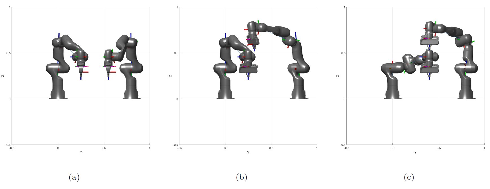
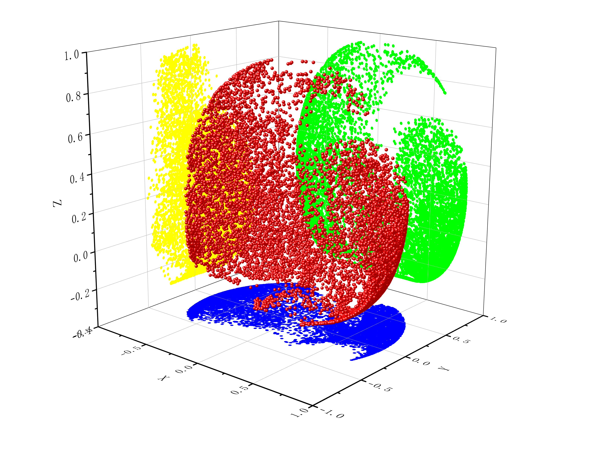
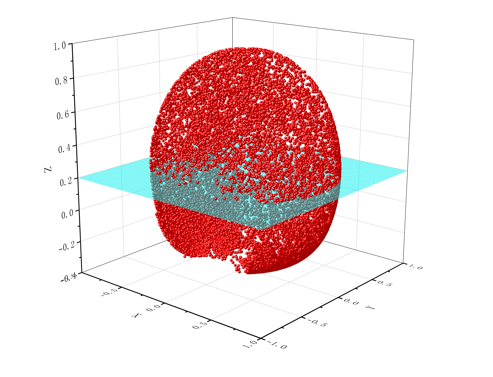
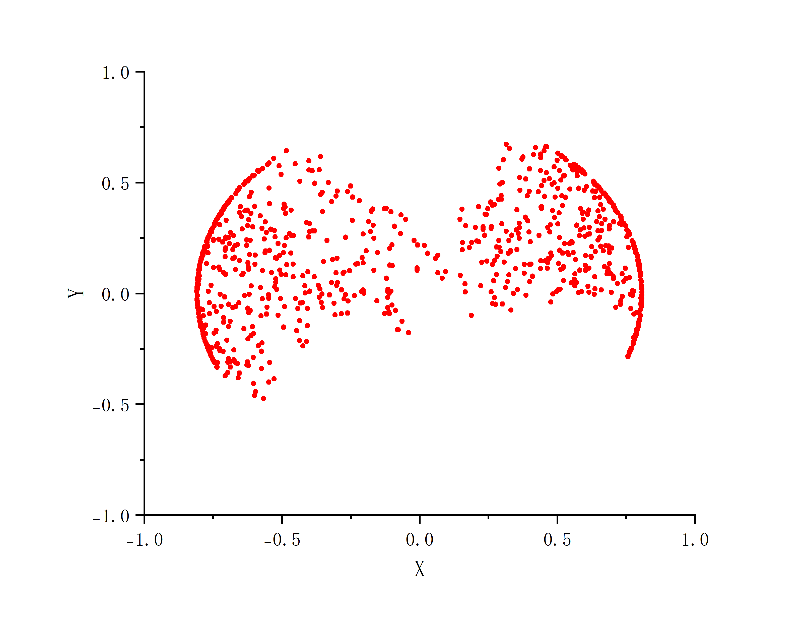

From Febuary till December, 2024, I joint a team of four to work on a dual-arm collaborative robot system. 

Under assistant professor Ze Wang's guidance, I mainly focus on finding the work space of the robot.

## Research Overview
*Advisor: Ze Wang, Professor and Assistant Dean at School of Mechanical Engineering, Tsinghua University*

The main focus of this study is to use dual-arm collaborative robot system to enhance the stiffness while working. Most dual-arm system do not have a rigid connection between the two arms. We are developing a system which have a rigid connection, which is the main innovation.

We designed three different configuration for the dual-arm system, as shown below:

- **Motion Trajectory Planning Research**
  - Summarized current research progress on motion trajectory planning of two-arm collaborative robots.
  - Identified key areas for improvement and proposed innovative solutions.

- **End Effector Stability Enhancement**
  - Improved the stability on the end effector of a two-arm collaborative robot.
  - Implemented techniques to ensure precise and consistent performance.

- **Workspace and Collision Analysis**
  - Analyzed the workspace and constraints of the robot.
  - Developed strategies to prevent collisions between the two arms of the collaborative robot.

- **Robot Configuration Design Collaboration**
  - Collaborated with a team of four to design different robot configurations.
  - Focused on improving stiffness and overall structural integrity of the robots.

## My Contribution
I mainly focus on the working space of this system. Unlike most dual-arm robot system, ours need to consider the problem of two robotic arms interfering with each other.

Using MATLAB to do simulating work, I developed a programme using Monte Carlo method to find the available workspace.

One example is shown below:

The red dots is the available dots, where the robot can reach under the strict rigid connection.

We can see the slice on the plate of z = 0.2:

Below is what is looked like on this plate:

[Click here](https://cloud.tsinghua.edu.cn/d/ea81f9defecc4959af53/) to find the original code