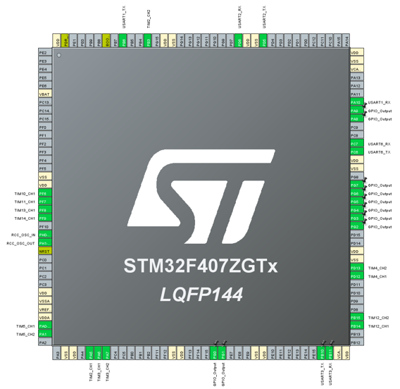

During one of our summer semester course, I led a team of three in designing an autonomous car-shaped vehicle capable of transporting objects from start to finish. The vehicle have integrated advanced features including line-following, obstacle navigation, destination location, and Bluetooth connectivity for remote control. 

I acquired proficiency in utilizing PID control algorithms to fine-tune input parameters for precise motor control. I utilized an STM32 microcontroller for vehicle control and Open MV for image capture (computer vision), trajectory planning, and dynamic output management.

## Task
Our vehicle is asked to finish two task automatically:
- line-following: pick up the stuff and carry it, move along the line and then place the stuff down at the end point
- path-finding: knowing the start-point and the end-point absolute position in the real world, but have a lot of obstacles in the path. The vehicle is asked to plan a suitable way for itself to find the end and put the stuff down.

### Hardware
We use STM32 as the main controller, controlling all the motors, servos, and send and grab data from bluetooth, openMV and Gyro (We use JY901S).

In the main function, read OpenMV, Bluetooth, and IMU data in a loop with 5ms as one unit. One loop takes 20ms (the remaining 5ms is used to process all the above data). Refresh motor and servo control data in each loop.

Detail issues:
- Interrupt conflict: prioritize encoder interrupt to ensure PID stability.
- Abnormal data: retain the last received data without refreshing.
- Check bit: avoid incorrect vehicle state control caused by accidental error transmission of data, enhance fault tolerance.

### Line following
The vehicle can follow the line automatically. Here is an video when we are still testing:

[Click here](https://zilin-chen-22.github.io/zilinchen.github.io/blog/intelligent-car/car_line.mp4) if not working.

### Path Finding

Here is one video while testing:

[Click here](https://zilin-chen-22.github.io/zilinchen.github.io/blog/intelligent-car/obstacles.mp4) if not working.

Here is another one:

[Click here](https://zilin-chen-22.github.io/zilinchen.github.io/blog/intelligent-car/obstacles2.mp4) if not working.