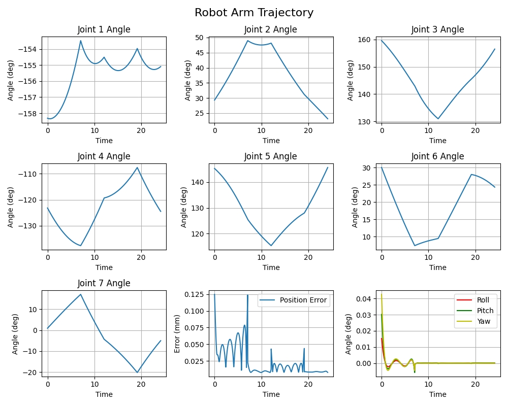
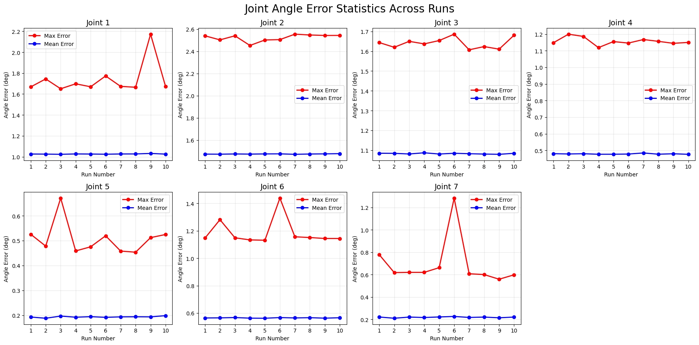
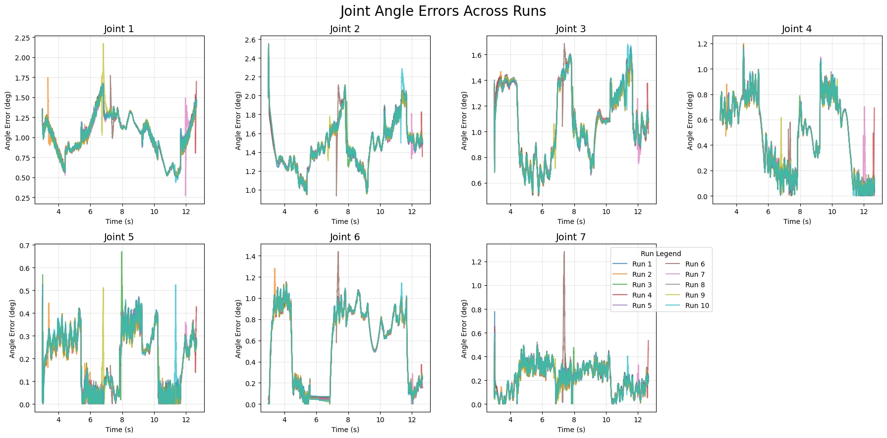

## Project Overview  
**Core Objective**: Develop motion planning algorithms for Xiaomi's 7-DOF humanoid robotic arm, enhancing motion precision (<0.3mm error), stability, and robustness against payload variations.  
**Technical Framework**:  
- Theoretical Basis: DH parameters, inverse kinematics (IK), trajectory interpolation
- Toolchain: MuJoCo simulation, C/Python co-development  
- Validation Protocol: Dual verification system complying with ISO 9283 standards (positioning accuracy, path repeatability)  
## Key Technical Achievements  
1. **Kinematics Algorithm Development**  
   - Forward Kinematics: Established DH-based coordinate transformation model with 0.1mm calculation precision  
   - IK Solver Optimization:  
     - Developed universal inverse kinematics interface auto-adapting to URDF configurations  
     - Hybrid numerical-geometric solution reducing end-effector positioning error to 0.3mm 
   - Trajectory Smoothing: Implemented Kalman filtering with B-spline interpolation, decreasing joint velocity fluctuations by 30%  
2. **Simulation-Physical Validation**  
   - MuJoCo Environment: Calibrated dynamic parameters (gravity compensation, joint friction models) matching h1_2 hardware specs  
   - Hardware-in-the-Loop Validation: <1.5% deviation in 50 test trajectories between simulation and physical tests  

    
    

        trajetory planner with filter
    

    
    
    

        enduable test results demo
    

## System Optimization  
**Three-Core Enhancement Strategy**:  
1. Fail-Safe Mechanism: Collision detection triggering 10ms emergency stop  
2. Computational Efficiency: optimized code achieving 1kHz control frequency  

**Strategic Recommendations**:  
1. Engineering: Implement fault injection testing for failure mode analysis  
2. Collaboration: Establish knowledge-sharing platform for URDF optimization  